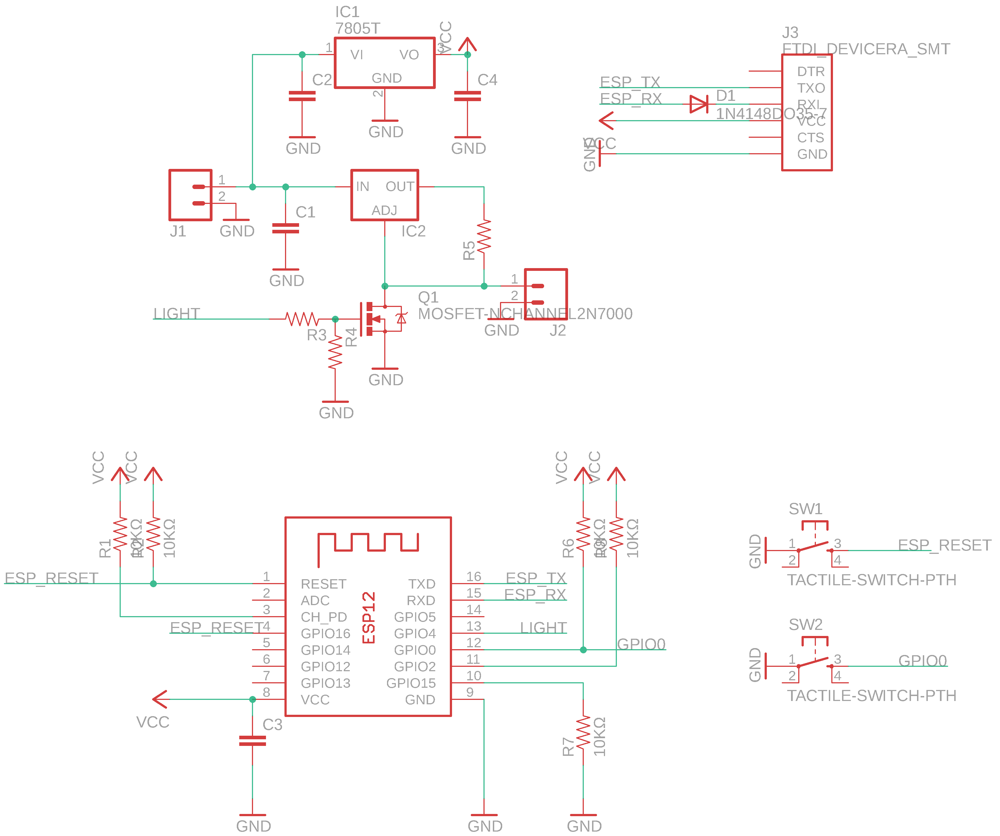
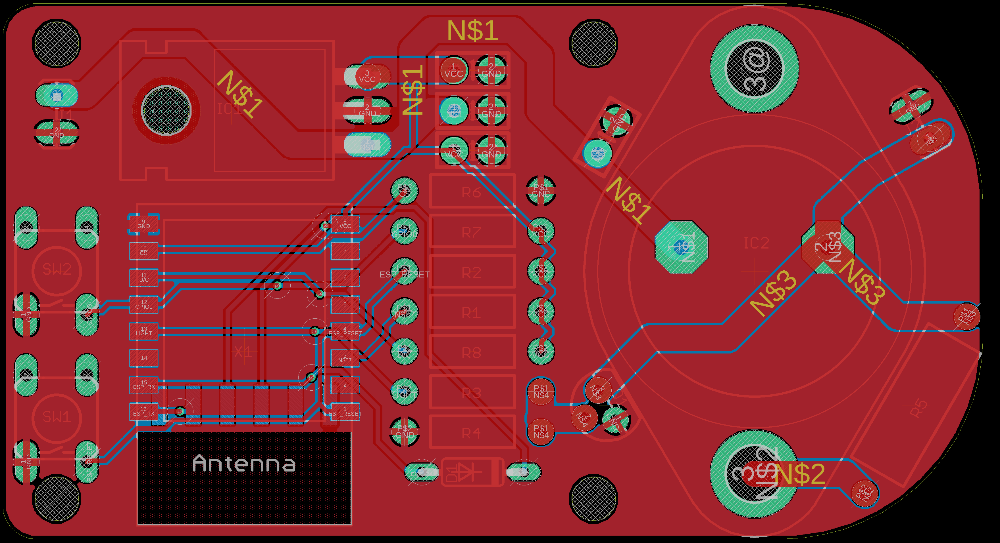

# sunrise
An OLED driver that simulates the rising sun

I got my hands on an OLED panel, and wanted to use it to simulate the rising sun, similar to those sunrise alarm clocks that use a high powered LED and gradually increase its brightness as approaches your wake up time.

The dimensions of the panel allowed me to easily stick it right above me. It works great, but gets a little warm, need to check out other ways of controlling the constant current device.

